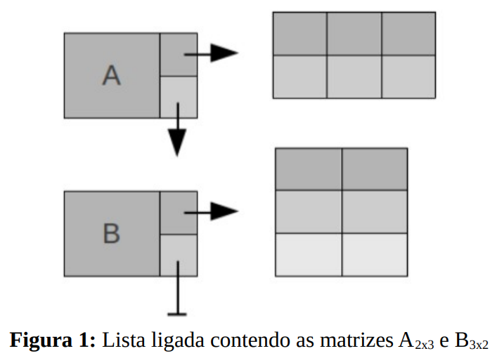

# Matrizes-de-Listas-Ligadas

## Descrição do Projeto 
É um programa para manipulação de matrizes de números reais que permite ao usuário: 
  1. Declarar uma matriz: fornecendo seu nome e dimensões desejadas.
  2. Destruir uma matriz: fornecendo seu nome. 
  3. Imprimir uma matriz: fornecendo seu nome. 
  4. Atribuir um elemento a uma matriz: fornecendo o nome da matriz, as coordenadas e o valor. 
  5. Atribuir uma linha a uma matriz: fornecendo o nome da matriz, o índice da linha e a sequência de elementos.
  6. Atribuir uma coluna a uma matriz: fornecendo o nome da matriz, o índice da coluna e a sequência de elementos.
  7. Transpor uma matriz: fornecendo seu nome e o nome da matriz resultante (não precisa estar declarada).
  8. Somar duas matrizes: fornecendo seus nomes e o nome de uma terceira matriz que deverá conter o resultado (não deve estar declarada). As 2 matrizes devem conter as mesmas dimensões.
  9. Dividir uma matriz por outra (elemento a elemento): fornecendo seus nomes e o nome de uma terceira matriz que deverá conter o resultado (não deve estar declarada). As 2 matrizes devem conter as mesmas dimensões e a matriz que será o denominador da divisão não deve conter nenhum elemento igual a 0.
  10. Multiplicar uma matriz por outra: fornecendo seus nomes e o nome de uma terceira matriz que deverá conter o resultado (não deve estar declarada). Sendo Am1xn1 e Bm2xn2 as matrizes de entrada e AxB a operação desejada, n1 deve ser igual a m2.
  11. Multiplicar duas matrizes (elemento a elemento): fornecendo seus nomes e o nome de uma terceira matriz que deverá conter o resultado (não deve estar declarada). As 2 matrizes devem conter as mesmas dimensões. 
 

Para exercer essas funções, o sistema mantêm uma lista ligada de matrizes onde cada nó contêm o nome da matriz, um ponteiro para a
matriz alocada dinamicamente (com as dimensões especificadas pelo usuário) e um ponteiro para o próximo nó. Os nós desta lista ligada são alocados
conforme a necessidade, ou seja, quando o usuário quer criar uma matriz ou chamar uma operação que resulte em uma matriz. A Figura 1 ilustra esta abordagem:
  

  
Quando o usuário optar por descartar uma matriz, esta é liberada da memória, assim como seu nó é liberado da lista ligada. Dois TAD's
(Tipos Abstratos de Dados) são implementados, um para a lista ligada e um para as matrizes. 
 

## Comandos e saídas
As funcionalidades do ambiente são requisitadas por meio de comandos seguidos dos dados necessários. Os comandos são representados por duas
letras maiúsculas. Os comandos que o sistema deve reconhecer são especificados a seguir. O símbolo // denota um comentário e portanto não faz
parte da saída ou dos comandos. 

### Criar matriz 
<table>
  <tr>
    <td>Comando</td>
    <td>CM &ltnome sem espaços&gt &ltnúmero de linhas&gt &ltnúmero de colunas&gt </td>
  </tr>
  <tr>
    <td>Saída</td>
    <td>OK //Em caso de sucesso  ERRO //Caso a matriz já exista ou alguma das dimensões não esteja entre 1 e 50</td>
  </tr>
</table>

### Destruir matriz  
<table>
  <tr>
    <td>Comando</td>
    <td>DM &ltnome&gt </td>
  </tr>
  <tr>
    <td>Saída</td>
    <td>OK //Em caso de sucesso  ERRO //Caso a matriz não exista</td>
  </tr>
</table>

### Imprimir matriz   
<table>
  <tr>
    <td>Comando</td>
    <td>IM &ltnome&gt </td>
  </tr>
  <tr>
    <td>Saída</td>
    <td>a1,1 ... a1,m ... //Separados por espaço (com formato %4.2f) an,1 ... an,m ERRO //Caso a matriz não exista </td>
  </tr>
</table>

### Destruir matriz  
<table>
  <tr>
    <td>Comando</td>
    <td>DM &ltnome&gt </td>
  </tr>
  <tr>
    <td>Saída</td>
    <td>OK //Em caso de sucesso  ERRO //Caso a matriz não exista</td>
  </tr>
</table>
